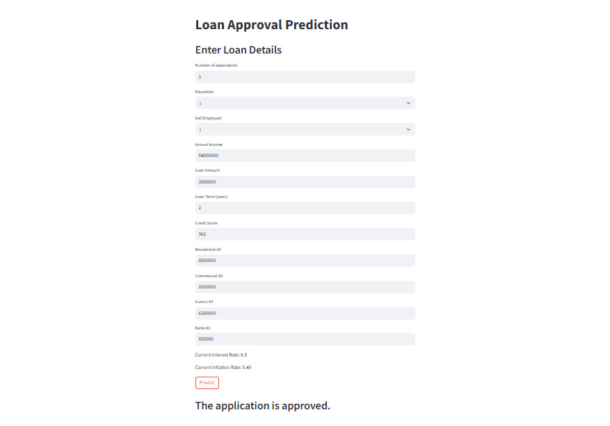

# Refined Loan Approval Prediction through Market Trends and Seasonal Analytics

## About
This project presents an advanced loan approval prediction model that incorporates real-time economic data and seasonal market trends to improve accuracy and decision-making for both lenders and borrowers. By utilizing machine learning techniques, this system adapts to current economic conditions, setting a new standard in predictive analytics for loan approvals.

## Features
- High accuracy loan approval predictions using LightGBM with GridSearch hyperparameter tuning.
- Integration of real-time data on market trends, such as interest rates and inflation.
- Interactive prediction portal developed using Streamlit, accessible to both lenders and applicants.
- Error handling for robust user interaction and minimal input mistakes.
- Provides real-time, adaptable predictions that reflect both short- and long-term economic shifts.

## Requirements
* **Operating System**: Compatible with Windows 10/11 or Ubuntu 20.04 LTS.
* **Processor**: Minimum Intel Core i3 or higher.
* **RAM**: 8 GB recommended.
* **Storage**: 256 GB SSD or 500 GB HDD.
* **Development Tools**:
  - **Programming Language**: Python 3.8+
  - **IDE**: Visual Studio Code or Jupyter Notebook
  - **Libraries**: LightGBM, Streamlit, Pandas, Scikit-learn, NumPy, and Trading Economics API.

## System Architecture
The system architecture diagram outlines the flow of data from collection and preprocessing through model training and prediction. The architecture integrates real-time economic data with user inputs, feeding these into the LightGBM model to predict loan approvals.

## Output
The prediction portal displays the result instantly, showing a confidence level for the decision:
- **Approved**: High probability of loan approval.
- **Rejected**: Indicates criteria not met or potential economic risk.

## Results and Impact
The refined loan prediction model achieved an accuracy of 99.4% during testing. By dynamically adjusting to real-time economic data, it offers a reliable, data-driven approach that balances financial risk with the evolving economic landscape. The system’s high accuracy and adaptability make it an asset for efficient loan processing, benefiting both financial institutions and loan applicants.

## References
1. S. Viswanatha, A.C. Ramachandra, K.N. Vishwas, "Prediction of Loan Approval in Banks using Machine Learning Approach," *International Journal of Engineering and Management Research*, 2023.
2. R. Kathe, L. Dapse, et al., "An Approach for Prediction of Loan Approval Using Machine Learning Algorithm," *International Journal of Creative Research Thoughts*, 2021.
3. S.P. Chavhan, N.R. Wankhade, "Loan Approval Prediction using Machine Learning," *International Journal of Advanced Research in Science, Communication and Technology*, 2023.
4. A. Kumar, I. Garg, S. Kaur, "Loan Approval Prediction based on Machine Learning Approach," *National Conference on Recent Trends in Computer Science and Information Technology*, 2016.
